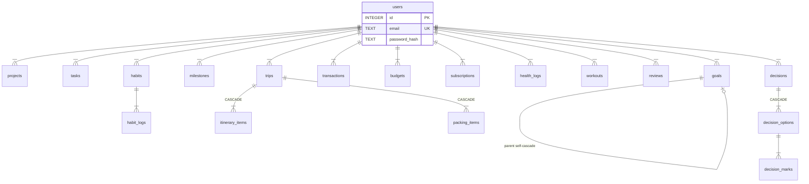

# FSD - LifeOS

| | |
|---|---|
| Versi | 1.0.0 (2026-09-18) |
| Acuan | PRD v1.0.0 |

## 1. Arsitektur

```text
Browser (web :5174)
  |
  v
API Go/Gin (:8080) — handler -> service -> repository (database/sql, tanpa ORM - ADR-001)
  |
  v
SQLite file lokal lifeos.db (migrasi goose 00001-00015, modernc.org/sqlite pure-Go)
```

- Backend Go 1.27/Gin + SQLite (`modernc.org/sqlite`, pure-Go tanpa CGO) + JWT (repo `lifeos`). Tanpa Docker by design; DB file lokal `lifeos.db`.
- Layer: handler (Gin binding) -> service (logika: overdue, streak, utilisasi, ranking, statistik) -> repository (`database/sql` tanpa ORM - ADR-001) -> SQLite. Migrasi goose (15 file 00001-00015).
- Frontend Vite + React 19 + TS + Tailwind v4 (repo `lifeos-web`). Tanpa react-router: state `Page` 13 halaman + Login, pill nav.
- QA: Newman 75 cek + Playwright 26 test + `tools/*.py` (repo `lifeos-qa`).
- Data: ETL Python read-only -> DuckDB parquet + matplotlib PNG + timer mingguan (repo `lifeos-data`).
- Ops: runbook/SLA/tiket + script backup/restore file (repo `lifeos-ops`).
- Auth: single-user; `POST /v1/auth/register` hanya akun pertama (kedua -> 403 `single_user_only`); JWT 24 jam (claim `sub=userID`); selain `/healthz` + auth, semua endpoint wajib Bearer (401 `unauthorized`); CORS echo `Origin == FRONTEND_URL`.
- Konvensi: PUT = full-replace (field tak dikirim dikosongkan); semua data di-scope `user_id`; zona Asia/Jakarta.

### 1.1 Konfigurasi & Ports

| Key | Nilai / Contoh | Keterangan |
|---|---|---|
| `PORT` | `8080` | Port API |
| `DB_PATH` | `lifeos.db` | File SQLite lokal (tidak di-commit) |
| `JWT_SECRET` | min 32 char | Secret JWT produksi (secret, tidak di-commit) |
| `FRONTEND_URL` | `http://localhost:5174` | Origin web yang diizinkan CORS |
| `VITE_API_URL` | `http://localhost:8080` | Base URL API di web |
| `LIFEOS_DB` | (opsional) | Override path DB untuk data pribadi (ETL) |

| Service | Port |
|---|---|
| API | 8080 |
| Web (dev) | 5174 |

## 2. Endpoint API (per `internal/handler/router.go`)

| ID | Method & Path | Fungsi | Spec |
|---|---|---|---|
| FS-01 | `GET /healthz` | Publik. 200 `{"status":"ok"}`| `swagger.yaml:L102` |
| FS-02 | `POST /v1/auth/register` | Publik. Akun pertama; validasi email + password min 8, bcrypt| `swagger.yaml:L108` |
| FS-03 | `POST /v1/auth/login` | Publik. -> `{token}` JWT 24 jam| `swagger.yaml:L120` |
| FS-04 | `GET /v1/me` | Profil sendiri| `swagger.yaml:L131` |
| FS-05 | `GET /v1/settings`, `PUT /v1/settings` | Baca/ganti (req: active_year, currency)| `swagger.yaml:L139` |
| FS-06 | `GET /v1/life-areas` | 8 area (seed)| `swagger.yaml:L156` |
| FS-07 | `GET /v1/dashboard` | Agregat home: tasks due/overdue, habits, finance, goals, subs, reminders| `swagger.yaml:L624` |
| FS-08 | `GET,POST /v1/projects` | List + progress / buat (req: name)| `swagger.yaml:L163` |
| FS-09 | `GET,PUT,DELETE /v1/projects/:id` | Detail / update / hapus| `swagger.yaml:L180` |
| FS-10 | `GET,POST /v1/tasks` | List (?status, ?project_id; overdue/days_remaining) / buat inbox (req: title)| `swagger.yaml:L210` |
| FS-11 | `GET /v1/tasks/today` | Due hari ini (WIB)| `swagger.yaml:L227` |
| FS-12 | `GET /v1/tasks/week` | Seminggu (?start, default hari ini)| `swagger.yaml:L234` |
| FS-13 | `GET,PUT,DELETE /v1/tasks/:id` | Detail / update (completed auto-stamp) / hapus| `swagger.yaml:L241` |
| FS-14 | `GET,POST /v1/goals` | List (?level annual/quarterly/monthly, cascade parent) / buat (req: title)| `swagger.yaml:L271` |
| FS-15 | `GET,PUT,DELETE /v1/goals/:id` | Detail / update / hapus| `swagger.yaml:L288` |
| FS-16 | `GET,POST /v1/milestones` | List (?goal_id, ?project_id, flag overdue) / buat (req: title, target_date)| `swagger.yaml:L318` |
| FS-17 | `GET /v1/milestones/upcoming` | Terdekat (?within_days=14)| `swagger.yaml:L344` |
| FS-18 | `GET,PUT,DELETE /v1/milestones/:id` | Detail / update (completed auto-stamp) / hapus| `swagger.yaml:L351` |
| FS-19 | `GET,POST /v1/habits` | List + streak / buat (req: name)| `swagger.yaml:L387` |
| FS-20 | `GET /v1/habits/streaks` | Semua streak| `swagger.yaml:L404` |
| FS-21 | `GET,PUT,DELETE /v1/habits/:id` | Detail / update / hapus| `swagger.yaml:L411` |
| FS-22 | `POST /v1/habits/:id/log` | Centang (default hari ini WIB; body date/done)| `swagger.yaml:L441` |
| FS-23 | `GET /v1/habits/:id/logs` | Riwayat (?from, ?to; heatmap)| `swagger.yaml:L459` |
| FS-24 | `GET,POST /v1/transactions` | List (?type, ?category, ?year, ?month) / catat (req: date, type, category, amount)| `swagger.yaml:L469` |
| FS-25 | `GET /v1/transactions/summary` | Ringkasan bulan| `swagger.yaml:L486` |
| FS-26 | `GET,PUT,DELETE /v1/transactions/:id` | Detail / update / hapus| `swagger.yaml:L493` |
| FS-27 | `GET,POST /v1/budgets` | List + aktual otomatis (?year, ?month) / buat (req: year, month, category, amount)| `swagger.yaml:L523` |
| FS-28 | `GET,PUT,DELETE /v1/budgets/:id` | Detail / update / hapus| `swagger.yaml:L540` |
| FS-29 | `GET,POST /v1/subscriptions` | List + annual_cost + days_until / tambah (req: service, next_billing)| `swagger.yaml:L570` |
| FS-30 | `GET /v1/subscriptions/upcoming` | Renewal (?within_days=14)| `swagger.yaml:L587` |
| FS-31 | `GET,PUT,DELETE /v1/subscriptions/:id` | Detail / update / hapus| `swagger.yaml:L594` |
| FS-32 | `GET,PUT /v1/health-logs` | List (?from, ?to) / upsert per tanggal (req: date)| `swagger.yaml:L631` |
| FS-33 | `GET,POST /v1/workouts` | List (?from, ?to) / catat (req: date, type)| `swagger.yaml:L658` |
| FS-34 | `GET,POST /v1/learning` | List / tambah (req: topic)| `swagger.yaml:L683` |
| FS-35 | `PUT,DELETE /v1/learning/:id` | Update / hapus (tanpa GET detail)| `swagger.yaml:L708` |
| FS-36 | `GET,POST /v1/reading` | List / tambah (req: title)| `swagger.yaml:L734` |
| FS-37 | `PUT,DELETE /v1/reading/:id` | Update / hapus (tanpa GET detail)| `swagger.yaml:L758` |
| FS-38 | `GET,POST /v1/reviews` | List + auto-stat / buat mingguan (req: week_start)| `swagger.yaml:L784` |
| FS-39 | `GET,PUT,DELETE /v1/reviews/:id` | Detail / update (hitung ulang stats) / hapus| `swagger.yaml:L808` |
| FS-40 | `GET,POST /v1/monthly-reviews` | List / buat (req: period YYYY-MM)| `swagger.yaml:L843` |
| FS-41 | `GET,PUT,DELETE /v1/monthly-reviews/:id` | Detail / update / hapus| `swagger.yaml:L867` |
| FS-42 | `GET,POST /v1/yearly-reviews` | List / buat (req: period YYYY)| `swagger.yaml:L902` |
| FS-43 | `GET,PUT,DELETE /v1/yearly-reviews/:id` | Detail / update / hapus| `swagger.yaml:L927` |
| FS-44 | `GET,POST /v1/trips` | List + actual_cost / buat (req: name, start_date, end_date)| `swagger.yaml:L962` |
| FS-45 | `GET,PUT,DELETE /v1/trips/:id` | Detail (+itinerary+packing) / update / hapus| `swagger.yaml:L988` |
| FS-46 | `POST /v1/trips/:id/itinerary` | Tambah item (req: date, activity)| `swagger.yaml:L1025` |
| FS-47 | `PUT,DELETE /v1/trips/:id/itinerary/:iid` | Toggle / hapus item| gap (tak ada di swagger) |
| FS-48 | `POST /v1/trips/:id/packing` | Tambah item (req: item)| `swagger.yaml:L1045` |
| FS-49 | `PUT,DELETE /v1/trips/:id/packing/:pid` | Toggle / hapus item| gap (tak ada di swagger) |
| FS-50 | `GET,POST /v1/decisions` | List + ranking terbobot / buat (req: title)| `swagger.yaml:L1064` |
| FS-51 | `GET,DELETE /v1/decisions/:id` | Detail + ranking / hapus (tanpa PUT)| `swagger.yaml:L1086` |
| FS-52 | `POST /v1/decisions/:id/options` | Tambah opsi (req: name)| `swagger.yaml:L1104` |
| FS-53 | `DELETE /v1/decisions/:id/options/:oid` | Hapus opsi| gap (tak ada di swagger) |
| FS-54 | `POST /v1/decisions/:id/options/:oid/marks` | Nilai opsi upsert per kriteria (req: criterion, score; weight opsional)| `swagger.yaml:L1122` |
| FS-55 | `GET,POST /v1/savings` | List + progres + ETA / tambah (req: name, target_amount)| `swagger.yaml:L1143` |
| FS-56 | `PUT,DELETE /v1/savings/:id` | Update / hapus (tanpa GET detail)| `swagger.yaml:L1168` |
| FS-57 | `GET,POST /v1/assets` | List + flag garansi / tambah (req: name)| `swagger.yaml:L1195` |
| FS-58 | `DELETE /v1/assets/:id` | Hapus (tanpa PUT/GET detail)| `swagger.yaml:L1219` |
| FS-59 | `GET,POST /v1/wishlist` | List + progres / tambah (req: item)| `swagger.yaml:L1228` |
| FS-60 | `DELETE /v1/wishlist/:id` | Hapus| `swagger.yaml:L1252` |
| FS-61 | `GET,POST /v1/documents` | List + days_until / tambah (req: item, expiry_date)| `swagger.yaml:L1261` |
| FS-62 | `GET /v1/documents/upcoming` | Hampir kedaluwarsa| `swagger.yaml:L1284` |
| FS-63 | `DELETE /v1/documents/:id` | Hapus| `swagger.yaml:L1291` |
| FS-64 | `GET,POST /v1/contacts` | List + followup_due / tambah (req: name)| `swagger.yaml:L1300` |
| FS-65 | `GET /v1/contacts/followups` | Butuh follow-up| `swagger.yaml:L1323` |
| FS-66 | `POST /v1/contacts/:id/touch` | Catat kontak hari ini| `swagger.yaml:L1330` |
| FS-67 | `DELETE /v1/contacts/:id` | Hapus| `swagger.yaml:L1339` |
| FS-68 | `GET,POST /v1/reminders` | List + next/days_until / tambah (req: title, date)| `swagger.yaml:L1348` |
| FS-69 | `GET /v1/reminders/upcoming` | Terdekat (?within_days=14)| `swagger.yaml:L1372` |
| FS-70 | `GET,PUT,DELETE /v1/reminders/:id` | Detail / update / hapus| `swagger.yaml:L1379` |

Detail request/response per endpoint: `api/swagger.yaml` repo `lifeos` (lihat kolom Spec; nomor baris `L…`).

Catatan: `api/swagger.yaml` tidak mendokumentasikan `PUT/DELETE itinerary/:iid` (FS-47), `PUT/DELETE packing/:pid` (FS-49), `DELETE options/:oid` (FS-53) — lihat kolom Spec `gap` (fungsi tetap berjalan).

## 3. Model Data (SQLite, goose 00001-00015)

- `users(id INTEGER PK, email TEXT UNIQUE, password_hash TEXT, created_at TEXT)`; `settings(user_id INTEGER PK FK->users, active_year INTEGER, currency TEXT, budget_warn_pct REAL, goal_warn_pct REAL)`; `life_areas(id INTEGER PK, name TEXT UNIQUE)` (8 seed).
- `projects(id INTEGER PK, user_id INTEGER, name TEXT, life_area_id INTEGER NULL, goal_id INTEGER NULL, status TEXT, start_date/end_date/completed_at TEXT NULL, notes TEXT)`; `tasks(id INTEGER PK, user_id INTEGER, project_id INTEGER NULL ON DELETE SET NULL, goal_id INTEGER NULL, life_area_id INTEGER NULL, title TEXT, status TEXT, priority TEXT, due_date TEXT NULL, completed_at TEXT NULL, effort_est/actual REAL NULL)`.
- `goals(id INTEGER PK, user_id INTEGER, level TEXT, parent_id INTEGER NULL self-ref ON DELETE CASCADE, life_area_id INTEGER NULL, title TEXT, metric TEXT NULL, target_value/current_value REAL, status TEXT, target_date TEXT NULL)`; `milestones(id INTEGER PK, user_id INTEGER, goal_id INTEGER NULL, project_id INTEGER NULL, title TEXT, target_date TEXT, status TEXT, completed_at TEXT NULL, notes TEXT NULL)`.
- `habits(id INTEGER PK, user_id INTEGER, name TEXT, frequency TEXT, target_per_week INTEGER, start_date TEXT, active INTEGER)` + `habit_logs(habit_id INTEGER, date TEXT, done INTEGER, PK(habit_id,date))`.
- `transactions(id INTEGER PK, user_id INTEGER, date TEXT, type TEXT, category TEXT, description TEXT NULL, amount REAL CHECK>0, account TEXT NULL, recurring INTEGER)`; `budgets(id INTEGER PK, user_id INTEGER, year INTEGER, month INTEGER, category TEXT, amount REAL CHECK>0, UNIQUE(user_id,year,month,category))`; `subscriptions(id INTEGER PK, user_id INTEGER, service TEXT, category TEXT NULL, cost REAL CHECK>=0, frequency TEXT, next_billing TEXT, active INTEGER)`.
- `health_logs(id INTEGER PK, user_id INTEGER, date TEXT UNIQUE, weight/sleep/water/energy/mood REAL NULL, notes TEXT NULL)`; `workouts(id INTEGER PK, user_id INTEGER, date TEXT, type TEXT, duration_min INTEGER NULL, intensity TEXT NULL, calories REAL NULL, notes TEXT NULL)`; `learning_entries` / `reading_entries` (CRUD pola sama, tanpa GET detail).
- `reviews/monthly_reviews/yearly_reviews(id INTEGER PK, user_id INTEGER, week_start/period TEXT UNIQUE, stats TEXT JSON, wins, challenges, lessons, next_focus TEXT NULL)`.
- `reminders(id INTEGER PK, user_id INTEGER, title TEXT, date TEXT, recurrence TEXT, notes TEXT NULL)`.
- `trips` + `itinerary_items` + `packing_items` (CASCADE); `decisions` + `decision_options` + `decision_marks` (CASCADE, UNIQUE per opsi+kriteria).
- `savings_goals`, `assets`, `wishlist`, `documents`, `contacts` (pola: id PK, user_id, name/item, amount/date, flags).
- Relasi: users 1-N semua tabel; goals self-cascade; FK ditegakkan via PRAGMA foreign_keys.



## 4. Aturan Bisnis

1. Tasks/milestones completed -> auto-stamp `completed_at`; overdue = due < hari ini dan bukan completed/cancelled.
2. Project progress = done/total (cap 0-100); goal progress = current/target (cap 0-100).
3. Budget actual = SUM expense kategori-bulan; util = actual/budget x 100; status safe/warning/over dari settings.
4. Habit streak berurutan; log upsert per (habit, tanggal); heatmap 30 hari.
5. Subs annual_cost + days_until; savings progres + ETA bulan = sisa/monthly_contribution.
6. Reviews stats JSON dihitung API saat create/update.
7. Reminders next-occurrence dari recurrence; upcoming <= 7/14 hari.
8. Trips actual_cost = SUM biaya itinerary; decisions ranking = SUM(weight x score), rekomendasi = max.
9. Assets flag garansi dari warranty_end; documents days_until + upcoming via reminder_days; contacts followup_due.
10. Enum validasi per modul (task 6 status, goal level/status, trx type, dsb - lihat FSD riset/appendiks kode).

## 5. Web UI (13 halaman + Login)

Dashboard (5 KPI + reminders 7d), Tasks (toggle + filter + quick-add + DONE/DEL + progres proyek), Goals (tab level + parent picker + UPDATE inline + milestone), Habits (streak + CENTANG + heatmap), Finance (input bulan + cashflow + budget util + subs + tabungan), Health (health today + workout + learning + reading), Calendar (grid bulan frontend-only + legenda), Travel (pill trip + itinerary + packing), Decisions (pill + ranking + form nilai), Assets (read-only: aset + wishlist + dokumen), Contacts (FOLLOW-UP + SAPA/touch), Reviews (tab period + stats + WINS/BLOCK/NEXT), Reminders (recurrence + DEL), Login (hero + form, prefill seed). Token `localStorage["lifeos_token"]`; 401 -> auto-logout per halaman. Base: `VITE_API_URL` default `http://localhost:8080`.

## 6. ETL / Analitik

Alur `run.py`: extract 9 tabel (read-only `mode=ro`) -> quality gates (ERROR gagalkan run: tabel kosong, orphan, amount <= 0, tanggal rusak, duplikat id; WARN: status di luar enum) -> 5 marts (`spending_daily`, `cashflow_monthly`, `budget_health`, `habit_rates`, `task_throughput`) -> parquet DuckDB -> 4 PNG (spending_by_category, cashflow_trend, habit_rates, task_throughput) -> `work/quality_report.json` + insight. Jadwal: systemd timer Senin 06:00 + cron.example. `run.sh` bootstrap `work/seed.db` bila absen; hormati `LIFEOS_DB` untuk data pribadi.

## 7. Operasional

Tanpa Docker. Run: `goose up` + seed + `go run ./cmd/api` (:8080) + `npm run dev` (:5174). Backup: copy `lifeos.db` -> `backups/lifeos-<TS>.db`, rotasi 7. Restore: guard tolak bila API jalan. Seed: 1 user (`aku@lifeos.local` / `Rahasia123`) + 7 goals + 25 tasks + 5 habits/80 logs + 32 trx + 4 budgets + 4 subs + health/learning/review/reminder/trip/decision/savings/asset/wishlist/document/contact fiktif.
